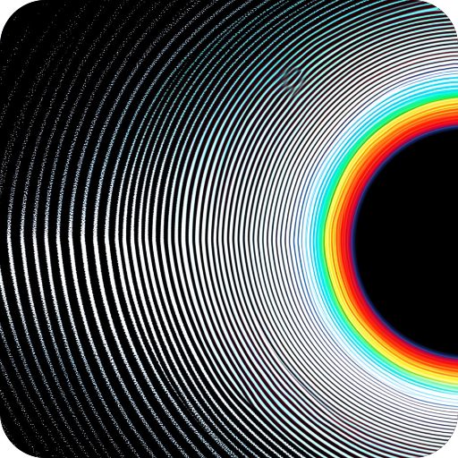

<p align="center">
  <a href="https://github.com/YASSER-27/my-awesome/releases/tag/1.3.0">
    
  </a>
</p>

Version 1.3.0

A desktop application for visually building and composing UI components on an interactive canvas. Drag components from the sidebar, connect them, preview live HTML/CSS output, and export or generate code.

## What's New in 1.3.0

### Expanded Categories and Tools

- Added more categories and sections.
- Added 25 new tools in each category for a wider range of design options.

### Professional AI Panel

- Integrated the AI panel directly with the canvas.
- Create new tools, update existing tools, or fix tools from the canvas workflow.
- Connect a ready-made page to any element and use Connected Components to generate the selected tool or component.
- Extract components from pages, games, and applications.

### Quick Tool

- View pages created with Designer 27.
- Generate images from prompt descriptions and link them to pages.
- Manage generated assets and images.
- Save assets as a ZIP file or keep them stored inside Quick.

### Quick Menu

The Quick Menu in the top navigation includes:

- Whole Page: Build pages step by step according to your design requirements.
- Single Component: Create new categories containing multiple sub-categories.

### Sidebar and Organization

- Added a Favorites section for saving important projects and accessing them quickly.
- Added Import functionality for saving projects and custom categories so they can be modified later.

### General Improvements

- Added more diverse tools to improve the overall building and design workflow.

## Features

- Interactive canvas for composing UI components.
- Drag-and-drop component workflow.
- Component connections and relationship management.
- Live HTML and CSS preview.
- Code generation and export support.
- Categories, tools, favorites, and imports for project organization.
- AI-assisted tool creation and updates.
- Asset and image management through Quick Tool.

## Getting Started

### Requirements

- Node.js
- npm

### Installation

```bash
npm install
```

### Development

```bash
npm run dev
```

### Build

```bash
npm run build
```

## Technology

- Electron
- React
- TypeScript
- Vite
- Tailwind CSS
- Zustand

## Repository

[my awesome](https://github.com/YASSER-27/my-awesome)

## Author

Yasser-27
